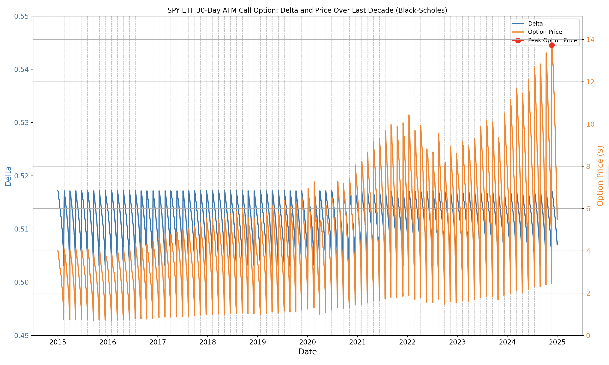

# 📈 Options Analytics & Black-Scholes Visualization

## Overview

This project models and visualizes the behavior of rolling **30-day at-the-money (ATM) call options** on the SPY ETF using the **Black-Scholes pricing formula**. It combines real historical market data from Yahoo Finance with financial theory to show how option sensitivity (Delta) and theoretical price evolve over time.

By plotting these dynamics, I explore how **Delta** of the **Greeks** change with **time to expiry**, **underlying price**, and **volatility** — key concepts in options trading and quantitative finance.

---

## Tools & Libraries

- `NumPy`, `pandas`: for modeling and data processing  
- `matplotlib`: for dual-axis time-series visualization  
- `yfinance`: to fetch SPY historical market data  
- Black-Scholes model: for theoretical option pricing and Delta calculation  

---

## What This Project Shows

- **Delta decay**: The sensitivity of an option to its underlying asset changes as expiry approaches.  
- **Moneyness shifts**: As SPY’s price fluctuates, options drift between in-the-money and out-of-the-money, affecting both price and Delta.  
- **Rolling expiries**: Simulating 30-day rolling options mimics the lifecycle of short-term positions often used by traders.  

The graph visualizes these insights together — offering a clear, data-driven window into how an option “breathes” with the market.

📉 **Graph Insight**:  
The dual-axis plot reveals that while **Delta remains relatively stable around 0.51**, the **option price steadily increases** alongside SPY. This demonstrates how **option prices can grow despite minimal changes in Delta**, emphasizing the role of underlying price trends and time decay in shaping value.

---

## Takeaways

This was my **first project in quantitative finance**, and it taught me:

- How to apply financial theory (Black-Scholes) to real-world market data  
- The importance of **time-to-expiry**, **volatility**, and **Greeks** in options valuation  
- How to communicate financial concepts through **visualization**  
- That even simple models like Black-Scholes reveal **powerful market dynamics**

---

## Why I did this

Understanding how options behave over time is foundational for building **risk-managed strategies**, whether for hedging or speculation. This project sets the stage for a future goal: building and backtesting complete **trading strategies** using Python.

It’s a small but meaningful step into the world of **quantitative trading**, where theory, data, and execution all converge.
